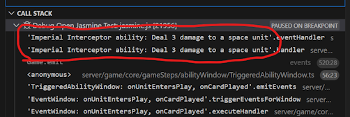
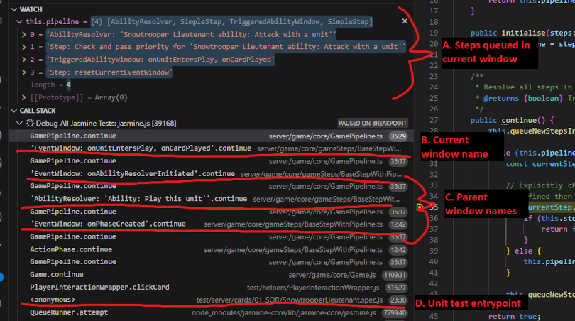

# IMPORTANT NOTE: DEPRECATED
All content is being migrated to the [wiki](https://github.com/SWU-Karabast/forceteki/wiki), please use that in the future.

# Debugging Cards and Game Logic

Finding the root cause of bugs in card behaviors or game logic can be daunting. However, there are some very effective tools and techniques available to help with debugging that can make it straightforward and efficient. This document presents some basic starting guides on how to leverage the tools present in Visual Studio Code (VSCode) and in this repo for effectively debugging issues.

The first section gives a high-level overview of how to debug in specific types of situations, such as problems with action abilities or with triggered abilities, and useful places in the code to start debugging for them. The second section lists some generally useful tools and techniques.

If you're unfamiliar with debugging in VSCode, start by reading below how to [trigger breakpoints after other breakpoints](#breakpoints-conditioned-on-other-breakpoints) as this technique should be used in every debugging situation below. Failing to do so will dramatically slow down your debugging.

## Situational debugging guides

### Action or action ability not triggering / resolving on click
If a game action (play a card, attack, smuggle) or an action ability (action printed on a card) is not available when the card is clicked, start with the following steps:

1. Set a up a breakpoint in your test and a [conditioned breakpoint](#breakpoints-conditioned-on-other-breakpoints) at this code line in ActionWindow.js: [`if (legalActions.length === 0) {`](https://github.com/AMMayberry1/forceteki/blob/418d09a36bf24e3905e3d3e6d1cd00793ef17d1b/server/game/core/gameSteps/ActionWindow.js#L38)

2. Inspect the value of the variable `actions`. It should list all available actions for the card (even if they are not legal). If your action doesn't appear in the list, then start debugging the code in ActionWindow.js that populates that variable.

3. If your action does appear in `actions`, then inspect the value of `legalActions`. This is the list of actions filtered down to just those whose requirements have been met. If your action doesn't appear in the list, then start debugging the code in ActionWindow.js that populates that variable.

4. If your action appears in both `actions` and `legalActions`, then it is being triggered correctly. If `legalActions` has only one item then it will be automatically resolved without prompting the user. If you are sure that the ability is not correctly resolving, then you need to move on to debugging the [individual GameSystems involved](#gamesystem-not-executing-correctly).

### Triggered ability not triggering / resolving on event
If a triggered ability is not activating in response to the expected trigger, start with the following steps:

1. Set a up a breakpoint in your test and a [conditioned breakpoint](#breakpoints-conditioned-on-other-breakpoints) at this code line in TriggeredAbility.ts: [`for (const player of this.game.getPlayers()) {`](https://github.com/AMMayberry1/forceteki/blob/418d09a36bf24e3905e3d3e6d1cd00793ef17d1b/server/game/core/ability/TriggeredAbility.ts#L78)

2. When the breakpoint is hit, look at the call stack to confirm that the ability being triggered is the ability you are attempting to debug (see image below). If not, use the continue button to keep hitting the breakpoint until the ability you want is triggered. If the ability is never triggered, then something is wrong with the trigger itself - double-check that you are using the right event name for the trigger and use the [game stack debugging steps](#debugging-the-game-rules-stack) to investigate whether the trigger event is happening as intended.

3. If you see that the relevant card ability is triggered, you can inspect the `event` parameter's properties to confirm that the emitted event matches what is expected.

4. Code execution must reach the line [`window.addToWindow(context);`](https://github.com/AMMayberry1/forceteki/blob/418d09a36bf24e3905e3d3e6d1cd00793ef17d1b/server/game/core/ability/TriggeredAbility.ts#L88) for the ability to be resolved. Step through the code and determine whether any of the checks that happen before that line are failing.

5. If [`window.addToWindow(context);`](https://github.com/AMMayberry1/forceteki/blob/418d09a36bf24e3905e3d3e6d1cd00793ef17d1b/server/game/core/ability/TriggeredAbility.ts#L88) is reached, then the trigger is working properly and the triggered ability is being queued for resolution. Move on [debugging the game system(s)](#gamesystem-not-executing-correctly) and the pipeline to determine what is causing resolution of the ability to fail.

### GameSystem not executing correctly
If an ability is triggering correctly but not resolving, it is most likely an issue with the execution of one or more of the relevant GameSystem(s). These are created using `AbilityHelper.immediateEffects.*` and usually set in the ability using the `immediateEffects` property.

Here are steps to get started with debugging the execution of a GameSystem.

1. Identify the GameSystem class in question, if not already known. If using a method from `AbilityHelper.immediateEffects`, you can find the corresponding entry in [GameSystemLibrary.ts](../server/game/gameSystems/GameSystemLibrary.ts) to identify the class used. E.g., for `AbilityHelper.immediateEffects.heal()` the created object is of class `HealSystem`.

2. There are two places to put breakpoints in the system class for watching the class's behavior. The first is the `canAffect()` method. This is called many times with different candidate cards (as the `card` parameter) to determine if the system can legally affect that card. Place a breakpoint in the top of the method, conditioned on a breakpoint in your test case.

3. The second point of interest is the `eventHandler()` method, which executes the logic of the GameSystem to change game state. Place a breakpoint at the top of this method, conditioned on the breakpoint in your test case. If the `eventHandler()` method for the system is empty, this GameSystem is one of a handful of special cases. Reach out to the core dev team for support in debugging.

4. Begin debugging. When the breakpoint for `canAffect()` is hit, add a variable watch in the debugger for `card.name` so you can see which card is currently being evaluated. Use the continue option to move forward until the card(s) you are interested in is hit. At that point, step through the evaluation of `canAffect()` to determine if it returns true (card can be legally affected by the system) or false. 
- **IMPORTANT**: `canAffect()` will likely be called multiple times on the same card. It must return true _every time_ in order for resolution to occur.

5. If the breakpoint in `eventHandler()` is never reached, then the card(s) of interest are almost certainly being filtered out during the `canAffect()` calls. If the breakpoint is reached, inspect the `event` parameter to ensure it matches expectations. In particular, double-check that the `event.card` property matches the expected card. From there, step though the resolution of the GameSystem to determine if the effect is resolving correctly.

## Debugging the game rules stack

The SWU rules are executed in the game logic as a set of nested windows, each with its own queue / pipeline of game steps to iterate through. This can be difficult to debug, but we have added some features that make it more convenient. 

The instructions in this section will show you how to step through the overall game pipeline and watch how the rules are being evaluated step-by-step. To start, ceate a breakpoint at this code line in GamePipeline.ts, conditioned on your unit test breakpoint: [`if (currentStep.continue() === false) {`](https://github.com/AMMayberry1/forceteki/blob/418d09a36bf24e3905e3d3e6d1cd00793ef17d1b/server/game/core/GamePipeline.ts#L35)

When you hit the breakpoint above, create a variable watch for `this.pipeline` and expand it. Your debug panel should now look like below:

Quick summary of the important information in the image above:

**A. Steps queued in current window:** these are the next steps to be executed in the current window. Continuing to debug will work through these steps or move into the current step if the current step represents a sub-window. Other steps may also add new steps onto the stack, causing it to grow.

**B. Current window name:** window names will appear in the stack as `'<window description>'.continue`. The one highest up in the stack will be the window owning the pipeline shown in `this.pipeline`.

**C. Parent window names:** names for the parent windows of this one, in order up the stack.

**D. Unit test entrypoint:** call site in the unit test.

Once you reach the above point you can start hitting "continue debugging" and hitting the breakpoint repeatedly to watch execution of the game steps. When you hit a step that you want to dive deeper in, use the "step into" option to dig into the execution of that step.

### Stepping through the pipeline tips and tricks
Each window is contained as a game step inside of its parent window, and is called with its own `continue()` method. So when you hit the breakpoint you may see the entire pipeline contents change. This is because you're now in a new window with a different set of steps queued. 

For example, in the sample image above, the next step queued is an ability resolver. So pressing the "continue" debug button will move to inside the ability resolver window and we will then see its pipeline in `this.pipeline`. You can confirm that this has happened by checking that there is a new window in the call stack.

In some other cases, a game step will add additional game steps into the current window. These will then move to the front of the stack, causing the stack to grow.

### Prompts and on-clicks in the pipeline
When user interaction is needed (e.g. for selecting a card for an ability target, or click a prompt), the pipeline will pause and will walk back up the stack of `continue()` calls and release control back to the test runner. The next time a `Player.onClick()` call is made during the test, the following steps will happen:

1. The game engine will walk down the stack again, calling the `onClick()` method for each window until it reaches the UI prompt. The prompt will update its state and then release control again, walking back up the stack to the test runner.

2. The runner will immediately call `Game.continue()`, which will resume execution of the game rules stack. If the prompt is fully resolved, then the pipeline will resume execution. Otherwise, it will pause again and wait for further user interaction.

## General debugging tools / methods

The following are useful tools and methods for debugging, either built-in to VSCode or using helpers that we've established in the repo. 

### Breakpoints conditioned on other breakpoints

Visual Studio code allows you to set up breakpoints with triggering conditions so that they are only hit when a certain condition is met. The most useful one for working in this repo is causing breakpoints to not trigger until another breakpoint has been hit. This is useful when you are debugging a GameSystem or engine component that will be triggered many times in a way that is unrelated to your test.

Typically you will create a breakpoint in your unit test case at the line of interest, and then create one or more breakpoint(s) inside the main game logic. If you set the game logic breakpoints to not trigger until after the breakpoint in the tests, you won't have to deal with potentially hundreds of unrelated breakpoint triggers before the test even starts.

For details on how to do this in VSCode (as well as other general debugging tricks), see the docs at [Debugging in Visual Studio Code](https://code.visualstudio.com/docs/editor/debugging#_advanced-breakpoint-topics).